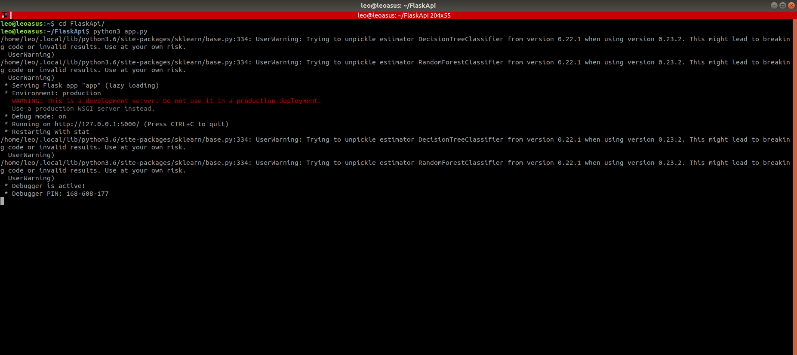
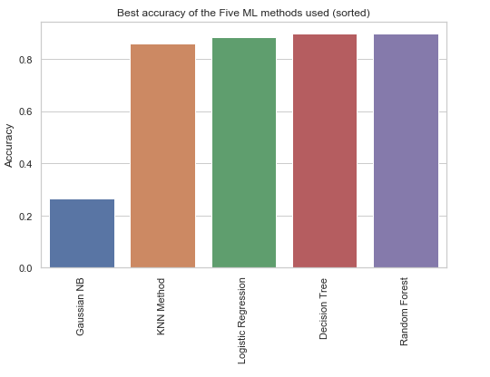

# Python for Data Analysis : Project Online Customers

The goal of this project is to predict if an online customer will buy sometyhing on the website or not. 
The result is a Flask API which can predict, when you entered the different infos about the customer, if the customer is going to buy something.

In this GitHub, there is :

- the code for launching the Flask API
- the Jupyter Notebook about the Pytghon study of the dataset + the ML
- a PowerPoint which explains the different steps

# How to launch the Flask API :

# The differents libraries used : 

- **Flask** 
- **Pickle**
- **Numpy**
- **Scikit-Learn**
- **Pandas**
- **Seaborn**
- **Matplotlib**

# RESULTS :

I created 5 ML Models ; let's compare the accuracy :

We can see that the best model is the RandomForest model !
